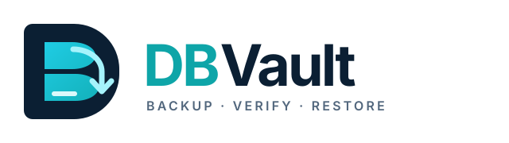

<div align="center">
  <picture>
    <source media="(prefers-color-scheme: dark)" srcset="assets/logo-dark.svg">
    <source media="(prefers-color-scheme: light)" srcset="assets/logo-light.svg">
    
  </picture>

  <p><strong>Database backup &amp; restore CLI</strong><br><sub>Built with Go for reliable, streaming infrastructure workflows.</sub></p>
</div>

[](https://golang.org)
[](LICENSE)
[](#current-project-status)

---

## Current Project Status

> [!IMPORTANT]
> **Audit Note (Current Implementation State):**
> The repository contains working **PostgreSQL, MySQL, MongoDB and SQLite adapters with local/S3/GCS/Azure storage** (`github.com/sung2708/DBVault`). No binary release has been tagged. See [verified status](docs/implementation-status.md) and [ADRs](docs/adr/README.md) for the implementation contract and test evidence.
>
> Throughout this documentation:
> - **Implemented**: Four adapters, four storage providers, none/gzip/zstd, SHA-256, metadata, verification, retention, destructive-operation guards, Slack and persistent cron schedules.
> - **Unsupported**: Incremental/differential recovery chains and client-side encryption. Cloud IAM/KMS and actual webhook delivery require operator validation; emulator tests cover the storage workflows.

---

## Overview

**DBVault** is a CLI utility written in Go designed to provide reliable, secure, and observable database backup and restore operations across multiple Database Management Systems (DBMS) and storage targets.

Managing database backups across heterogenous database fleets often requires stitching together disparate shell scripts, wrapper tools, and ad-hoc cron jobs. DBVault unifies database dumping, streaming compression, integrity checksumming, and destination uploads into a single, cohesive tool with standardized configuration and security practices.

### Architectural Philosophy

DBVault uses native logical dumps for PostgreSQL, MySQL and MongoDB. SQLite uses an embedded driver to create a consistent snapshot before streaming. Go manages compression, integrity verification, storage and cancellation:

```text
CLI (Cobra)
   ↓
Application Service (Orchestrator)
   ↓
Database Adapter (Parameter & Flag Generation)
   ↓
Native Archive/SQL Dump or SQLite Snapshot
   ↓
Streaming Pipeline (io.Reader / io.Writer)
   ↓
Compression (none, gzip, zstd)
   ↓
Checksum Calculator (crypto/sha256)
   ↓
Storage Provider (Local filesystem, S3, GCS, Azure Blob)
   ↓
Completed Backup Registration (JSON sidecar)
```

Key architectural tenets:
1. **Bounded memory:** Pipelines use bounded buffers instead of loading entire archives into RAM. SQLite backup requires temporary snapshot disk space; restore spools verified archives to private temporary files.
2. **Direct process execution:** Native subprocesses use argument vectors without shell interpreters. Cancellation terminates owned child processes.
3. **Always verify integrity:** Backups calculate SHA-256 checksums on the fly and verify them prior to restore.
4. **Secrets stay out of process tables:** Passwords and tokens are passed exclusively through environment variables or transient secure credential files, never as CLI arguments.

---

## Features

| Feature | Status | Description |
|---|---|---|
| **Unified CLI Interface** | Implemented | Grouped help, command workflows/examples, actionable input errors and schedule subcommands |
| **PostgreSQL Adapter** | Implemented | Custom archive streaming via pg_dump; restore via pg_restore |
| **MySQL Adapter** | Implemented | Oracle MySQL 8.x/InnoDB logical dumps; full SQL restore |
| **MongoDB Adapter** | Implemented | Native archives; database dumps require quiesced writes |
| **SQLite Adapter** | Implemented | Consistent VACUUM INTO snapshot and online backup API restore |
| **Local Storage** | Implemented | Flat keys, confined filesystem access, atomic publication, private permissions |
| **AWS S3 Storage** | Implemented | Official SDK multipart upload with conditional publication |
| **Google Cloud Storage** | Implemented | Official SDK resumable upload with conditional publication |
| **Azure Blob Storage** | Implemented | Official SDK block blob upload with conditional publication |
| **Gzip Compression** | Implemented | Streaming compression with levels 1–9 |
| **Zstandard (zstd) Compression** | Implemented | Streaming compression with bounded decoder memory |
| **Integrity Checksums** | Implemented | SHA-256 over stored bytes; mandatory verification before restore |
| **Sidecar Metadata** | Implemented | Versioned JSON metadata; completed manifests register backups |
| **Slack Notifications** | Implemented | HTTPS backup/restore completion and failure notifications |
| **Cron Scheduling** | Implemented | Persistent definitions and supervised foreground daemon |
| **Retention Cleanup** | Implemented | Explicit cleanup command; per-database count/age protections; newest backup always retained |
| **Dry-Run Mode** | Implemented | Backup preflight, verified restore preflight, deletion/cleanup preview |

---

## Supported Databases Capability Matrix

The following capability matrix reflects the verified implementation status across target database engines:

| Capability | PostgreSQL | MySQL | MongoDB | SQLite |
|---|:---:|:---:|:---:|:---:|
| **Connection Test** | SUPPORTED | SUPPORTED | SUPPORTED | SUPPORTED |
| **Full Backup** | SUPPORTED | SUPPORTED | SUPPORTED | SUPPORTED |
| **Full Restore** | SUPPORTED | SUPPORTED | SUPPORTED | SUPPORTED |
| **Selective Backup** | SUPPORTED | SUPPORTED | PARTIAL | UNSUPPORTED |
| **Selective Restore** | SUPPORTED | UNSUPPORTED | SUPPORTED | UNSUPPORTED |
| **Streaming Pipeline** | SUPPORTED | SUPPORTED | SUPPORTED | PARTIAL |
| **Incremental Backup** | UNSUPPORTED | UNSUPPORTED | UNSUPPORTED | UNSUPPORTED |
| **Differential Backup** | UNSUPPORTED | UNSUPPORTED | UNSUPPORTED | UNSUPPORTED |
| **Required Native Tool(s)** | `pg_dump`, `pg_restore`, `psql` | `mysqldump`, `mysql` | `mongodump`, `mongorestore` | None; embedded SQLite |

MongoDB selected backup accepts one included collection per archive or multiple
exclusions. SQLite first creates a private snapshot, then streams it. All engines
use the same four storage providers; cloud E2E drills exercise SQLite and native
drills exercise PostgreSQL/MySQL/MongoDB. See the full
[acceptance matrix](docs/implementation-status.md).

> [!NOTE]
> Database incremental and differential backups require database-specific write-ahead log (WAL/binlog/oplog) archiving and cannot be handled generically across database engines. Initial releases focus on robust full logical backups.

---

## Installation

### Prerequisites
- **Go**: Version 1.26 or higher
- **Native Client Binaries**:
  - PostgreSQL: `pg_dump`, `pg_restore`, `psql`
  - MySQL: `mysqldump`, `mysql`
  - MongoDB: `mongodump`, `mongorestore` Database Tools 100.x
  - SQLite: embedded pure Go driver; no executable needed

Go is needed to build from source. Native tools must be available in `PATH` when
running the corresponding adapter. PostgreSQL dump tools must match the server
major; Oracle MySQL clients must match its 8.x release series.

### Go Install

Install the CLI from a published module version, without cloning the repository:

```bash
go install github.com/sung2708/DBVault/cmd/dbvault@latest
```

**Add Go's binary directory to `PATH` after installation.** `go install` places
`dbvault` (`dbvault.exe` on Windows) in `GOBIN`, or `GOPATH/bin` when `GOBIN` is
unset; it does not update `PATH` automatically. If you see `command not found`
or `The term 'dbvault' is not recognized`, follow the steps below.

**Windows (PowerShell):** Save the directory in your user PATH and make it
available in the current terminal:

```powershell
$goBin = (go env GOBIN).Trim()
if (-not $goBin) {
    $goBin = Join-Path ((go env GOPATH) -split [IO.Path]::PathSeparator)[0] 'bin'
}
$userPath = [Environment]::GetEnvironmentVariable('Path', 'User')
if (($userPath -split ';') -notcontains $goBin) {
    [Environment]::SetEnvironmentVariable('Path', "$goBin;$userPath", 'User')
}
if (($env:Path -split ';') -notcontains $goBin) {
    $env:Path = "$goBin;$env:Path"
}
```

**Linux / macOS (Bash or Zsh):** Determine the directory and add it to the
current terminal's PATH:

```bash
go_bin="$(go env GOBIN)"
if [ -z "$go_bin" ]; then
    go_path="$(go env GOPATH)"
    go_bin="${go_path%%:*}/bin"
fi
export PATH="$go_bin:$PATH"
```

To keep it available in new terminals, run the command for your shell once:

```bash
# Bash
printf '\nexport PATH=%q:"$PATH"\n' "$go_bin" >> "$HOME/.bashrc"

# Zsh (the default shell on modern macOS)
printf '\nexport PATH=%q:"$PATH"\n' "$go_bin" >> "$HOME/.zshrc"
```

Bash login shells must also load `~/.bashrc` from their login profile for that
setting to apply. Other shells require their own PATH configuration.

Verify installation after updating PATH:

```text
dbvault --help
dbvault version
```

Use `@vX.Y.Z` instead of `@latest` to pin an actual published tag.
This installs DBVault only;
native PostgreSQL/MySQL/MongoDB tools are separate prerequisites. The current
working-tree changes become available through this command after maintainers
publish them; no release is created by this work.

### Prebuilt Binaries

Maintainer-triggered releases package Linux amd64/arm64, macOS amd64/arm64 and
Windows amd64 archives with `checksums.txt`. See the
[release assets](https://github.com/sung2708/DBVault/releases) for published
versions. This work prepares that pipeline and does not publish assets.

### Building from Source

```bash
# Clone the repository
git clone https://github.com/sung2708/DBVault.git
cd DBVault

# Download dependencies and validate the checkout
go mod download
go test ./...

# Build the binary (or: make build)
go build -o bin/dbvault ./cmd/dbvault

# Add the binary to PATH for this terminal session
export PATH="$PWD/bin:$PATH"

# Verify installation
dbvault version
dbvault --help
```

On Windows, after cloning and entering the repository:

```powershell
go build -o bin/dbvault.exe ./cmd/dbvault
$env:Path = "$PWD\bin;$env:Path"
dbvault version
dbvault --help
```

Alternatively, install the current checkout into Go's configured binary directory:

```bash
go install ./cmd/dbvault
```

Add that directory to `PATH`. There is no tagged binary release from this work;
see [installation](docs/installation.md) for OS-specific dependency setup.

---

## Discover the CLI

Help works without a configuration file, credentials or database connection:

```text
dbvault --help
dbvault backup --help
dbvault restore --help
dbvault schedule --help
dbvault schedule add --help
dbvault help verify
```

| Goal | Command |
|---|---|
| Validate YAML, then check database connectivity | `config`, `test` |
| Create a full backup | `backup` |
| Find backup names and read metadata | `list`, `inspect` |
| Check stored size and SHA-256 | `verify` |
| Restore a verified backup | `restore` |
| Delete one backup or apply retention | `delete`, `cleanup` |
| Save schedules and run their foreground daemon | `schedule` |
| Show version/build information | `version` |

Commands accept flags; archive operations use `--target`, not a positional backup
ID. Use the **name** returned by `list`, not the manifest ID. `--output json`
(or `--json`) selects pure JSON results and JSON diagnostics on stderr.
Human terminals get cyan headings, status indicators, tables and real progress;
redirected output is stable text without cursor control. `--no-color`, `NO_COLOR`
and `--quiet` disable decoration/animation. Help remains concise human text.
See [terminal output](docs/terminal-ui.md). Database/storage options come
from YAML, with documented environment and CLI overrides.

---

## Quick Start

### 1. Initialize Configuration

Create `dbvault.yaml` with connection details for an existing PostgreSQL database.
Install matching native tools before running the database commands:

```yaml
version: "1"

database:
  type: postgres
  host: localhost
  port: 5432
  user: postgres
  password_env: DB_PASSWORD
  database: production_app
  ssl_mode: prefer

storage:
  type: local
  local:
    path: ./backups

compression:
  type: gzip
  level: 6
```

Set the database password via the designated environment variable:

```bash
export DB_PASSWORD="your-secure-database-password"
```

On PowerShell, set the same environment variable with:

```powershell
$env:DB_PASSWORD = [System.Net.NetworkCredential]::new(
  "", (Read-Host "Database password" -AsSecureString)
).Password
```

### 2. Validate Configuration and Test Connection

Validate connectivity and client tool availability without taking a backup:

```bash
dbvault config --config dbvault.yaml
dbvault test --config dbvault.yaml
```

### 3. Run a Full Backup

```bash
dbvault backup --config dbvault.yaml --dry-run
dbvault backup --config dbvault.yaml
```

### 4. Restore from Backup

```bash
dbvault list --config dbvault.yaml
# Replace backup.dump.gz with the actual name returned by list.
dbvault verify --config dbvault.yaml --target backup.dump.gz
dbvault restore --config dbvault.yaml --target backup.dump.gz --dry-run
# Stop application writes before restoring; this can overwrite data.
dbvault restore --config dbvault.yaml --target backup.dump.gz --confirm
```

`--dry-run` restore verifies the archive and destination without database writes.
SQLite requires an existing destination file. MongoDB/MySQL restores are not
atomic across all data; plan recovery accordingly.

---

## Configuration Example

DBVault separates configuration structure from secret storage. **Never place cleartext passwords in configuration files.**

```yaml
version: "1"

database:
  type: postgres              # postgres | mysql | mongodb | sqlite
  host: 127.0.0.1
  port: 5432
  user: backup_operator
  password_env: DB_PASSWORD   # Reads from environment variable
  database: mydb
  ssl_mode: verify-full       # disable | require | verify-ca | verify-full
  options:
    exclude_tables:
      - audit_logs_temp
      - cache_sessions

storage:
  type: local                 # local | s3 | gcs | azure
  local:
    path: ./backups
    permissions: "0700"

compression:
  type: gzip                  # none | gzip | zstd
  level: 6                    # Supported range: 1-9

retention:
  keep_days: 30
  keep_count: 14

notifications:
  slack:
    enabled: false
    webhook_url_env: SLACK_WEBHOOK_URL
```

This example targets PostgreSQL. TLS modes and filters differ by engine. Use the
matching template rather than changing only `database.type`:

| Template | Purpose |
|---|---|
| [example.yaml](configs/example.yaml) | PostgreSQL and local storage |
| [mysql.yaml](configs/mysql.yaml) | Oracle MySQL 8.x/InnoDB |
| [mongodb.yaml](configs/mongodb.yaml) | MongoDB; writes must remain stopped during dumps and `quiesced: true` acknowledges this |
| [sqlite.yaml](configs/sqlite.yaml) | Existing SQLite file |
| [s3.yaml](configs/s3.yaml) | S3 storage and credential configuration |
| [gcs.yaml](configs/gcs.yaml) | GCS storage and credential configuration |
| [azure.yaml](configs/azure.yaml) | Azure Blob storage and credential configuration |

Select storage with `storage.type` in YAML. `--output-dir` overrides only the
local directory; it does not switch a cloud backend to local. Omitted
`--compression` uses configuration. See the [configuration reference](docs/configuration.md).

---

## Backup & Restore Examples

### PostgreSQL Logical Backup with Gzip
```bash
# Run backup using configuration file
dbvault backup --config configs/example.yaml

# Run backup overriding target database and storage path
dbvault backup --config configs/example.yaml --database analytics_db --output-dir /mnt/backups
```

### Dry-Run Verification
```bash
dbvault backup --config configs/example.yaml --dry-run
```

### Restoring with Integrity Verification
```bash
# Replace backup.dump.gz with a name from list.
dbvault restore --config configs/example.yaml --target backup.dump.gz --dry-run
dbvault restore --config configs/example.yaml --target backup.dump.gz --confirm
```

### Backup Management

```bash
dbvault list --limit 10
dbvault inspect --target backup.dump.gz
dbvault delete --target backup.dump.gz --dry-run
dbvault delete --target backup.dump.gz --confirm
dbvault cleanup --keep-days 30 --keep-count 7 --dry-run
```

`cleanup` without `--dry-run` deletes candidates immediately; it has no confirmation
flag. Age and count policies both protect backups, and the newest per database is
always kept. Both policies set to zero disable deletion.

### Scheduled Backups

```bash
dbvault schedule add --id nightly --cron "0 2 * * *" --config dbvault.yaml
dbvault schedule list
dbvault schedule
```

Adding a schedule saves its definition; it does not start backups. The last command
runs the foreground daemon. Keep it running; Ctrl+C cancels active work. Saved
definitions default to `.dbvault-schedules.json` in the current directory. Restart
the daemon after add/remove/enable/disable changes. Cron uses UTC unless the
expression includes a timezone, such as `CRON_TZ=Asia/Bangkok 0 2 * * *`.
Overlapping jobs are skipped; missed runs are not replayed. See [scheduling](docs/scheduling.md).

### Docker Runtime Targets

Build the target containing the native clients needed for your engine:

```bash
docker build --target postgres -t dbvault:postgres .
docker build --target mysql -t dbvault:mysql .
docker build --target mongodb -t dbvault:mongodb .
docker build --target sqlite -t dbvault:sqlite .
docker run --rm dbvault:postgres --help
```

Targets run as non-root users. PostgreSQL includes client 16, MySQL includes 8.4
clients, MongoDB includes its Database Tools, and SQLite needs no client executable.
Actual backups additionally require mounted configuration/storage, credentials and
network access to the database. These are local build recipes, not published images.

---

## Security Model Summary

- **Credential Isolation:** Passwords and authentication tokens are loaded via environment variables (`password_env`), never as command-line arguments (preventing exposure in `ps aux` process listings).
- **Process Security:** Subprocesses are invoked directly with argument slices (`os/exec.CommandContext`), preventing shell string interpolation and injection.
- **Filesystem Hardening:** Created local files use `0600`, and created directories use `0700`. Existing directory permissions and Windows ACLs remain operator-managed.
- **Integrity Validation:** Every backup produces a SHA-256 hash stored in an atomic sidecar file (`.meta.json`), validated before any restore operation begins.
- **Destructive Operation Guard:** Restore/delete require `--confirm` unless previewing with `--dry-run`. Cleanup deletes immediately unless previewing.
- **Integrity Boundary:** SHA-256 detects corruption; unsigned manifests require trusted storage. It does not authenticate backups against malicious replacement.

See [docs/security.md](docs/security.md) and [SECURITY.md](SECURITY.md) for complete details.

---

## Development & Testing

```bash
# Run unit tests
go test ./...

# Run tests with race detection
go test -race ./...

# Run static code analysis
go vet ./...

# Real database and cloud-emulator backup/destroy/restore drills (requires Docker)
go test -v -timeout=20m -tags=integration ./test/integration/...
```

The CLI help audit exercised all 18 public nodes on Windows and Linux. Database
and cloud-emulator restore drills passed; live IAM/KMS, actual Slack delivery and
macOS execution remain unverified. Current evidence is in
[implementation status](docs/implementation-status.md) and [CLI help audit](docs/cli-help-audit.md).

See [docs/development.md](docs/development.md) and [CONTRIBUTING.md](CONTRIBUTING.md) for details on code standards and testing workflows.

---

## Documentation Index

Explore the complete technical documentation:

| Document | Purpose |
|---|---|
| [Getting Started](docs/getting-started.md) | Step-by-step tutorial from installation to first restore |
| [Architecture](docs/architecture.md) | Architectural blueprints, component boundaries, and sequence diagrams |
| [Installation](docs/installation.md) | OS-specific setup, native database client guides, and PATH verification |
| [Configuration Reference](docs/configuration.md) | Comprehensive specification of all configuration keys, types, and defaults |
| [CLI Reference](docs/cli-reference.md) | Complete reference for all CLI commands, arguments, and flags |
| [Backup Guide](docs/backup.md) | Deep dive into the backup lifecycle, pipeline streaming, and checksumming |
| [Restore Guide](docs/restore.md) | Restore procedures, pre-flight safety checks, and recovery drills |
| [Database Adapters](docs/databases.md) | Capabilities, flags, and caveats for PostgreSQL, MySQL, MongoDB, and SQLite |
| [Storage Providers](docs/storage.md) | Local filesystem and official S3/GCS/Azure SDK providers |
| [Security Model](docs/security.md) | Threat model, secret handling, shell injection prevention, and integrity |
| [Scheduling & Automation](docs/scheduling.md) | Automated cron jobs, systemd timers, and containerized scheduling |
| [Testing Strategy](docs/testing.md) | Unit, integration, race condition, and manual restore validation drills |
| [Development Guide](docs/development.md) | Developer onboarding, interface implementations, and coding standards |
| [Troubleshooting Guide](docs/troubleshooting.md) | Diagnostics and resolution steps for common backup and restore errors |
| [Project Roadmap](docs/roadmap.md) | Current implementation state, next milestones, and future initiatives |
| [Release Policy](docs/releasing.md) | Release governance, SemVer rules, documentation gates, and release hygiene |
| [CLI Help Audit](docs/cli-help-audit.md) | Command inventory, help workflows, and acceptance checks |
| [Architecture Decision Records (ADRs)](docs/adr/README.md) | Formal records of architectural and engineering decisions |

---

## Roadmap Summary

- **Implemented:** Four engines/providers, compression, integrity, retention, Slack and persistent cron schedules, with database and emulator restore drills.
- **Future work:** Engine-specific physical recovery chains, client-side encryption and metrics; live-cloud deployment validation.
- **Prepared tooling:** Docker packaging, CI and release workflows; remote workflow execution remains unverified.
- **Release work:** Publish reviewed tags/images after live operational validation.

See [docs/roadmap.md](docs/roadmap.md) for implementation milestones and remaining work.

---

## License

This project is licensed under the MIT License - see the [LICENSE](LICENSE) file for details.
