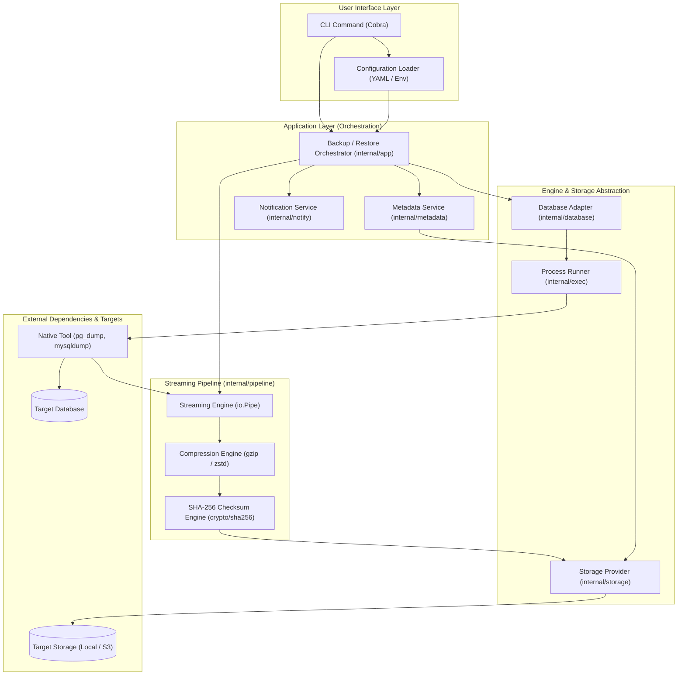
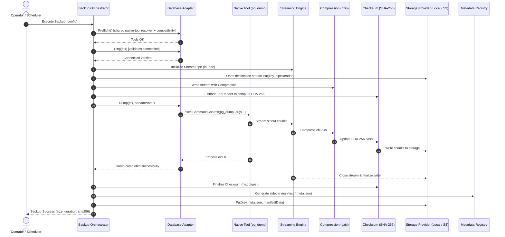
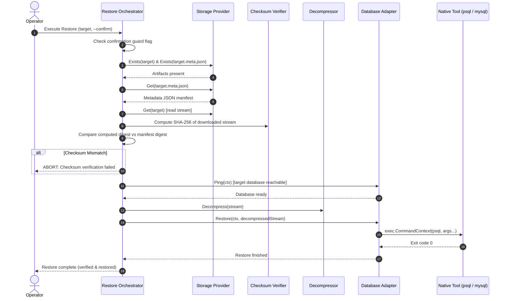

# DBVault System Architecture

For client-side encryption, logical incremental chains, all-engine isolated
recovery drills, metrics and recurring recovery jobs, see [operator instructions](enhancements.md).

This document describes the architectural principles, component structure, data flow, and dependency boundaries of DBVault.

## Current implementation contract

Restore workflows in v0.5.0 add adapter interfaces for new-target preflight and
creation and for full safety backups without selection filters. The application
reuses a verified snapshot, coordinates optional destination protection and
post-restore checks, and stores separate versioned restore history records.
Export shares snapshot verification and exclusively creates a local output file.
These history records do not replace recovery-drill evidence consumed by health.
See [ADR-0012](adr/0012-restore-workflows-and-history.md).

[ADR-0007](adr/0007-verified-local-foundation.md) resolves format/naming/security
ambiguities in this blueprint. Actual interfaces live in `internal/database`,
`internal/storage`, `internal/compression` and `internal/exec`; the sketches below
illustrate boundaries rather than exact current signatures. In particular,
database adapters expose explicit capabilities, Preflight returning server/tool
versions, restore selectors and compatibility validation. The runner supports
argv, isolated/removed environment entries, streaming stdin/stdout, bounded
redacted stderr, exit errors and context cancellation.
`internal/toolresolve` is the shared executable resolver: configured paths win,
then PATH, then bounded known platform locations. `init` stores discovered
absolute paths in `database.tools`; adapters, test, doctor, backup and restore
consume those same paths. SQLite remains independent of external executables.

`internal/cli` wires Cobra commands; `cmd/dbvault` handles build metadata, signals
and exit status. `internal/app` coordinates adapters/providers. Backup is one-pass
streaming; restore verifies into a private compressed snapshot to avoid reopening
mutable stored bytes after verification. Local artifact publication is atomic;
completed manifest publication is the separate registration step. Host crashes
between those steps may leave unregistered orphan artifacts.

MongoDB archive tools and embedded SQLite snapshot/online restore follow
[ADR-0009](adr/0009-mongodb-sqlite-cloud-scheduling.md). SQLite backup and every
restore stage complete snapshots on private temporary disk. Cloud uploads use
bounded SDK chunks and conditional publication. The optional cron daemon calls
the same backup command and skips overlapping work; Slack delivery has a separate
timeout and cannot turn a successful backup into failure.

---

## 1. Architectural Philosophy and Goals

DBVault is built as a single, statically linked binary designed to orchestrate database backup and restore operations with production reliability. The core architectural tenets are:

1. **Zero Memory Spooling (Streaming First):** Databases can span gigabytes to terabytes. DBVault never loads dumps into system memory. All data flows through Go `io.Reader` and `io.Writer` streaming pipes with constant memory footprint ($O(1)$ RAM usage).
2. **Subprocess Isolation & No Shell Execution:** DBVault executes resolved native database binaries directly using Go's `os/exec.CommandContext` with structured argument vectors (`[]string`). It never spawns a shell interpreter (`sh -c` or `cmd.exe /c`), preventing shell injection.
3. **Defense-in-Depth Secret Protection:** Passwords, authentication keys, and API tokens are never accepted as command-line flags. They are resolved at runtime from environment variables and communicated to subprocesses via transient environment descriptors (e.g. `PGPASSWORD`, `MYSQL_PWD`) or secure temporary configuration files with restricted permissions.
4. **End-to-End Cryptographic Integrity:** All backup streams compute a streaming SHA-256 digest on the fly. The digest is stored in an atomic sidecar metadata file and strictly validated before any restore procedure begins.
5. **Fail-Safe Cleanup & Cancellation:** All operations take a Go `context.Context`. If an operation is canceled (via `SIGINT`, `SIGTERM`, or timeout), child processes are immediately terminated, and any partial or corrupted backup artifacts are safely pruned.

---

## 2. System Architecture

The following diagram illustrates the relationship between components during execution:



---

## 3. Package Boundaries and Dependency Direction

DBVault enforces a strict acyclic dependency structure following Clean Architecture principles:

```text
cmd/dbvault/
   └── internal/app/ (Orchestration)
          ├── internal/config/ (Configuration structures and loader)
          ├── internal/database/ (Database contracts and driver adapters)
          │      └── internal/database/postgres/
          │      └── internal/database/mysql/
          ├── internal/storage/ (Storage contracts and provider implementations)
          │      └── internal/storage/local/
          │      └── internal/storage/{s3,gcs,azure}/
          ├── internal/compression/ (gzip, zstd streaming wrappers)
          ├── internal/pipeline/ (Streaming tee, hashing, progress tracking)
          ├── internal/exec/ (Safe process execution and signal handling)
          ├── internal/metadata/ (Backup manifest schema and validation)
          └── internal/model/ (Domain entities and status enums)
```

### Dependency Rules:
- `cmd/` packages only configure CLI commands and wire up `internal/app/`.
- `internal/app/` coordinates use cases (Backup, Restore, Test, Verify) and depends only on abstraction interfaces (`database.Adapter`, `storage.Provider`, `compression.Compressor`).
- Adapter packages (`internal/database/*`, `internal/storage/*`) implement interfaces defined in their parent or model package and never depend on `internal/app/`.
- Utilities (`internal/exec/`, `internal/compression/`, `internal/pipeline/`) are domain-agnostic and do not import database or storage drivers.

---

## 4. Core Abstractions and Interfaces

### 4.1 Database Adapter Abstraction (`internal/database`)

```go
package database

import (
	"context"
	"io"
)

// Adapter defines the contract required for every database engine.
type Adapter interface {
	// Name returns the identifier of the database engine (e.g., "postgres", "mysql").
	Name() string

	// Ping validates connection credentials and connectivity to the database.
	Ping(ctx context.Context) error

	// Preflight resolves required native tools and validates tool/server compatibility.
	ValidateEnvironment(ctx context.Context) error

	// Dump initiates a streaming logical backup writing directly to the provided io.Writer.
	Dump(ctx context.Context, writer io.Writer) error

	// Restore reads a backup stream from the provided io.Reader and restores it into the database.
	Restore(ctx context.Context, reader io.Reader) error
}
```

### 4.2 Storage Provider Abstraction (`internal/storage`)

```go
package storage

import (
	"context"
	"io"
	"time"
)

// ObjectMetadata describes an artifact stored in the storage backend.
type ObjectMetadata struct {
	Key          string
	Size         int64
	LastModified time.Time
	ETag         string
}

// Provider defines storage operations for backup archives and metadata files.
type Provider interface {
	// Put writes a stream to the storage location under the given key.
	Put(ctx context.Context, key string, reader io.Reader, size int64) error

	// Get retrieves a stream of the stored object under the given key.
	Get(ctx context.Context, key string) (io.ReadCloser, error)

	// Exists checks if an object exists at the specified key.
	Exists(ctx context.Context, key string) (bool, error)

	// Delete removes the specified object.
	Delete(ctx context.Context, key string) error

	// List returns metadata for all objects matching the prefix.
	List(ctx context.Context, prefix string) ([]ObjectMetadata, error)
}
```

### 4.3 Compression Engine Abstraction (`internal/compression`)

```go
package compression

import "io"

// Compressor defines streaming compression and decompression.
type Compressor interface {
	// Extension returns the file extension (e.g., ".gz", ".zst").
	Extension() string

	// Compress wraps an io.Writer with a streaming compression writer.
	Compress(w io.Writer) (io.WriteCloser, error)

	// Decompress wraps an io.Reader with a streaming decompression reader.
	Decompress(r io.Reader) (io.ReadCloser, error)
}
```

---

## 5. Backup Orchestration Sequence

The backup workflow follows a rigorous lifecycle from pre-flight validation to atomic manifest registration:



---

## 6. Restore Orchestration Sequence

Restoration is treated as a high-risk operation with safety pre-checks:



---

## 7. Metadata Specification

Every backup produces a sidecar manifest written to `{backup_name}.meta.json`:

```json
{
  "manifest_version": "1.0",
  "backup_name": "production_app_20261001_020000.dump.gz",
  "created_at": "2026-10-01T02:00:00Z",
  "database": {
    "engine": "postgres",
    "version": "16.1",
    "database_name": "production_app",
    "host": "db.prod.internal",
    "format": "custom"
  },
  "pipeline": {
    "compression": "gzip",
    "compression_level": 6,
    "uncompressed_bytes": 524288000,
    "compressed_bytes": 104857600
  },
  "checksum": {
    "algorithm": "sha256",
    "hash": "e3b0c44298fc1c149afbf4c8996fb92427ae41e4649b934ca495991b7852b855"
  },
  "duration_seconds": 45.2,
  "status": "completed"
}
```

---

## 8. Cancellation and Failure Handling

1. **Context Propagation:** All operations accept a Go `context.Context` tied to OS signals (`SIGINT`, `SIGTERM`).
2. **Subprocess Termination:** When the context is canceled, `os/exec` automatically issues a termination signal to child processes (`pg_dump`, `mysqldump`).
3. **Artifact Cleanup on Failure:** If a backup terminates with a non-zero exit code or context cancellation, the storage provider's `Delete()` method is invoked to remove incomplete backup archives, preventing corrupted or partial files from polluting the backup destination.
