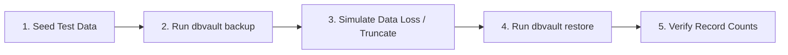

# Restore Operations & Recovery Procedures

A backup is only as good as its proven ability to restore. This document details DBVault's restoration lifecycle, pre-flight safety validations, and recovery testing drills.

For new dated destinations, destination safety backups, interactive selection,
restore history and verified file exports starting with v0.5.0,
see [restore workflows](restore-workflows.md).

## Safe operator-facing recovery drill (SQLite V1)

`dbvault recovery drill --target NAME --recovery-database NEW-PATH --confirm`
reuses the existing restore pipeline against an exclusively created SQLite file.
It refuses existing targets, production/source aliases and ambiguous paths, then
requires read-only `PRAGMA integrity_check` and a catalog query after restore.
This is stronger evidence than `verify`, which only checks stored size/SHA-256.
Validation covers SQLite structure, not application data semantics.

`--dry-run` verifies/preflights without target creation and is not a passed drill.
Targets are preserved by default and on failure/cancellation. Explicit `--cleanup`
removes only the same file created by this invocation after successful validation;
replacements/unexpected SQLite sidecars abort cleanup. Separate records associate
evidence with the exact backup without altering immutable manifests. Missing
production files do not prevent embedded-engine preflight, provided source parent
is resolvable. No production safety bypass or shell validation hooks exist.

Release `v0.4.0` adds **PostgreSQL drills** in a newly created Docker
server using fresh credentials, no external network, ports or host binds. It
reuses the verified snapshot and performs read-only catalog/table readability
checks. Preload the trusted official image matching the source major; see
[PostgreSQL drill setup](installation.md#postgresql-recovery-drills) and
[ADR-0011](adr/0011-postgresql-container-recovery.md).
The current checkout adds [MySQL/MongoDB isolated drills](enhancements.md).
Existing normal restore follows its
existing confirmation contract. See [CLI semantics](cli-reference.md#dbvault-recovery-drill).

All adapters verify the exact compressed snapshot before writes. MySQL restores
SQL through `mysql`; MongoDB restores native archives, supports `--collection`
and namespace remapping, and requires matching server major/tools. Their restores
are not atomic as a whole. SQLite validates a second decompressed image and uses
its online backup API against an existing destination; temporary space must hold
both the compressed snapshot and SQLite image. The destination's entire contents
are replaced. See [database strategies](databases.md) for each engine's limits.

## Current PostgreSQL restore contract

The implemented format is a native custom archive (`.dump`, optionally `.gz` or
`.zst`), restored with `pg_restore`, not psql. Checksums cannot be bypassed.
Before any writes, DBVault validates versioned metadata, copies/hashes the exact
stored bytes into a private temporary file, checks compressed size and SHA-256,
then validates database engine/format and server/client version compatibility.
It decompresses that same snapshot into pg_restore with `--exit-on-error`,
`--single-transaction`, `--no-owner`, and `--no-privileges`.

Restore requires temporary disk space for one compressed artifact; memory is
bounded. Temporary snapshots are removed on success, failure and cancellation.
`--dry-run` performs these checks without database writes. `--confirm` authorizes
actual restoration. Only trusted backups should be restored: a sidecar checksum
detects corruption but does not authenticate an attacker-controlled manifest.

`--clean` adds `--clean --if-exists`. `--table` and `--schema` select archive
entries; dependencies may need to be present in the target. Owner/ACL settings
are intentionally not reapplied. See [ADR-0007](adr/0007-verified-local-foundation.md).

The lifecycle sketches below originally described the plaintext SQL strategy;
apply the current custom-format contract above where they differ. MySQL sections
describe the implemented full SQL strategy; see ADR-0008 for its restrictions.

---

> [!WARNING]
> **Production Safety Warning:**
> Restoring a backup is an inherently destructive operation that can overwrite active tables, schemas, and records. DBVault requires explicit confirmation via the `--confirm` flag before any restore execution will proceed. 
> 
> Regular automated restore testing drills should be performed in isolated staging environments to guarantee disaster recovery readiness.

---

## 1. Restore Lifecycle Overview

The restore process enforces strict integrity checks prior to executing native database writes:

```text
1. Parse Target & Verify Confirmation Flag (--confirm)
         ↓
2. Locate Archive & Sidecar Manifest (.meta.json)
         ↓
3. Compute SHA-256 Checksum on Archive
         ↓
4. Match Computed Hash vs Manifest Hash (Abort on mismatch)
         ↓
5. Test Target Database Reachability (Ping)
         ↓
6. Initialize Streaming Decompressor (gzip.Reader)
         ↓
7. Spawn Native Client Process (psql / mysql)
         ↓
8. Stream SQL Data Directly to Native Client Stdin
         ↓
9. Verify Subprocess Exit Code (0 = Success)
```

---

## 2. Integrity Verification (Pre-Flight Checksumming)

Before invoking any restore tool, DBVault verifies data integrity:

1. Looks for the sidecar manifest `{archive}.meta.json`.
2. Computes the SHA-256 hash of the target backup archive.
3. Compares the hash against `checksum.hash` inside the manifest.
4. If a mismatch is detected:
   ```text
   [FATAL] Integrity check failed!
   Expected SHA-256: 9f86d081884c7d659a2feaa0c55ad015a3bf4f1b2b0b822cd15d6c15b0f00a08
   Computed SHA-256: e3b0c44298fc1c149afbf4c8996fb92427ae41e4649b934ca495991b7852b855
   Restore aborted to prevent corruption. Locate a verified backup instead.
   ```

---

## 3. Restore Commands and Usage

### Safe Standard Restore
```bash
dbvault restore \
  --config dbvault.yaml \
  --target ./backups/production_db_20261001_020000.dump.gz \
  --confirm
```

### Clean Restore (Dropping Existing Objects)
To drop existing database objects before recreating them:
```bash
dbvault restore \
  --config dbvault.yaml \
  --target ./backups/production_db_20261001_020000.dump.gz \
  --clean \
  --confirm
```

### Restoring to a Staging Database
To restore into a different database (e.g. for disaster recovery testing), override the database flag:
```bash
dbvault restore \
  --config dbvault.yaml \
  --database staging_recovery_test \
  --target ./backups/production_db_20261001_020000.dump.gz \
  --confirm
```

---

## 4. Native Tool Invocation Mechanics

DBVault streams decompressed data directly into the standard input (`stdin`) of native database tools:

### PostgreSQL
- **Format:** Native custom archive (`.dump.gz`)
- **Native Command Executed:**
  ```bash
  pg_restore --dbname=<database> --exit-on-error --single-transaction --no-owner --no-privileges
  ```
- **Authentication:** Injected via the `PGPASSWORD` process environment variable.

### MySQL
- **Format:** Plaintext SQL (`.sql.gz`)
- **Native Command Executed:**
  ```bash
  mysql -h <host> -P <port> -u <user> <database>
  ```
- **Authentication:** Injected via temporary options file or `MYSQL_PWD` environment variable.

---

## 5. Routine Disaster Recovery Verification Drill

To establish high confidence in your backup strategy, run the following automated verification drill regularly:



1. **Seed:** Populate a test table with $10,000$ known records.
2. **Backup:** Execute `dbvault backup --database drill_db`.
3. **Simulate Loss:** Truncate or drop the test table.
4. **Restore:** Execute `dbvault restore --target ... --confirm`.
5. **Verify:** Query table count and assert that all $10,000$ records exist.
